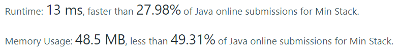
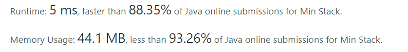

## 155. Min Stack

[155. Min Stack](https://leetcode.com/problems/min-stack/)

문제에서 제공된 메서드들이 모두 상수시간 내에 동작하도록 작성하면 됩니다.

> 개인적으로 이 문제 풀면서 다른 관심 갖다가 오늘 하루 보낸 거 같습니다. <br> 
> 관련 내용은 별도로 블로그에 정리 해 봤습니다. - [Stack의 제네릭 타입과 Object 배열?](https://velog.io/@sally_devv/MinStack)

저는 처음에는 최소값만 추가하면 된다고 생각했습니다. 새로운 값이 가진 값 이하이면 추가하게 했습니다.
- 여기서 작은 실수는, 처음 empty 일 때 값을 넣어준다는 걸 생각지 못 햇고, 채울때마다 비교해서 작은 값을 넣어주는 방향으로 작성 했습니다.
- 2개씩 채우니 stack 하나로 하자 생각했습니다.

``` java
class MinStack {
    Stack<Element> stack = new Stack<>();
    
    public MinStack() {
        stack = new Stack<>();
    }
    
    public void push(int val) {
        if(stack.isEmpty()) {
            stack.push(Element.of(val, val));
            return;
        }
        stack.push(Element.of(val, stack.peek().getMinVal(val)));
    }
    
    public void pop() {
        stack.pop();
    }
    
    public int top() {
        return stack.peek().getValue();
    }
    
    public int getMin() {
        return stack.peek().getMinValue();
    }
    
    private Element toArr(int stack, int minStack) {
        return Element.of(stack, minStack);
    }
    
    static class Element {
        private int stackVal;
        private int minVal;
        
        private Element(int stackVal, int minVal){
            this.stackVal = stackVal;
            this.minVal = minVal;
        }
        
        
        public static Element of(int stackVal, int minVal){
            return new Element(stackVal, minVal);
        }
        
        public int getMinVal(int newVal){
            return Math.min(this.minVal, newVal);
        }
        
        public int getValue(){
            return this.stackVal;
        }
        
        public int getMinValue(){
            return this.minVal;
        }
    }
}
```




### 2nd

나중에는 처음 생각한대로 되도록,
초기값만 채워주면 된다는 걸 좀더 확신하면서 고쳐 봤습니다. (저는 배열을 사용하려고 i 치기 싫어지면, 클래스로 갑니다. 배열이 작성하기 더 빠르고 간편합니다...)
- 코드는 좀 복잡해져서 시간복잡도는 크게 예상 못 했는데, 좋아졌습니다. ㅎㅎ 
  - stack 의 push(), pop() 이 작성하긴 좋지만, 메서드 마다 synchronized 로 동작해서 인 것 같습니다. (이런면에서 Queue는 인터페이스로 다양한 구현체들로 사용할 수 있다고 생각됐습니다.)

``` java
class MinStack {
    Stack<Integer> stack = new Stack<>();
    Stack<MinElement> minStack = new Stack<>();
    
    public MinStack() {
        stack = new Stack<>();
        minStack = new Stack<>();
    }
    
    public void push(int val) {
        if(minStack.isEmpty() || minStack.peek().isSmallerOrAddCountWhenSameAs(val)) {
            minStack.push(MinElement.of(val));
        }
        stack.push(val);
    }
    
    public void pop() {
        if(!minStack.peek().isRemoveLast(stack.peek())) minStack.pop();
        stack.pop();
    }
    
    public int top() {
        return stack.peek();
    }
    
    public int getMin() {
        return minStack.peek().getVal();
    }
    
    private static class MinElement {
        private int min;
        private int count;
        
        private MinElement(int minVal) {
            this.min = minVal;
            this.count = 0;
        }
        
        public static MinElement of(int minVal){
            return new MinElement(minVal);
        } 
        
        public int getVal(){
            return this.min;
        }
        
        public boolean isSmaller(int val){
            return this.min > val;
        }
        
        public boolean isSameAs(int val){
            return this.min == val;
        }
        
        public void addLast() {
            this.count++;
        }
        
        public boolean isSmallerOrAddCountWhenSameAs(int val){
            if(isSameAs(val)) {
                addLast();
                return false;
            }
            return isSmaller(val);
        }
        
        public boolean isRemoveLast(int stackPeekValue) {
             if(isSameAs(stackPeekValue) && this.count > 0) {
                this.count--;
                return true;
            } 
            if(!isSameAs(stackPeekValue)) {
                return true;
            } 
            // if(this.count <= 0){
            //     return false;
            // }
            return false;
        }
    }
}
```

